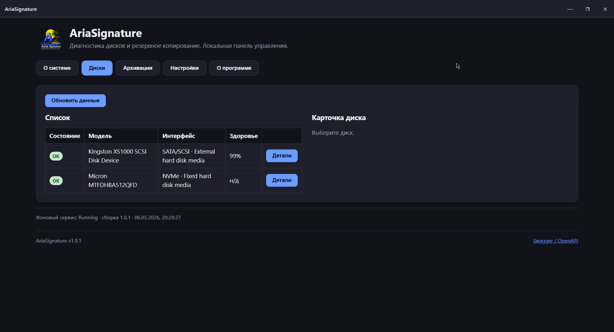
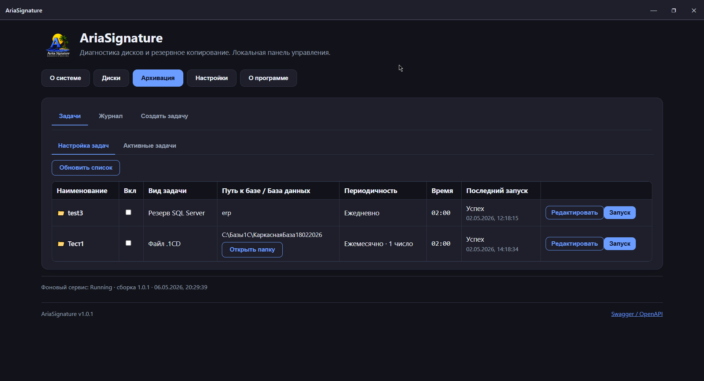
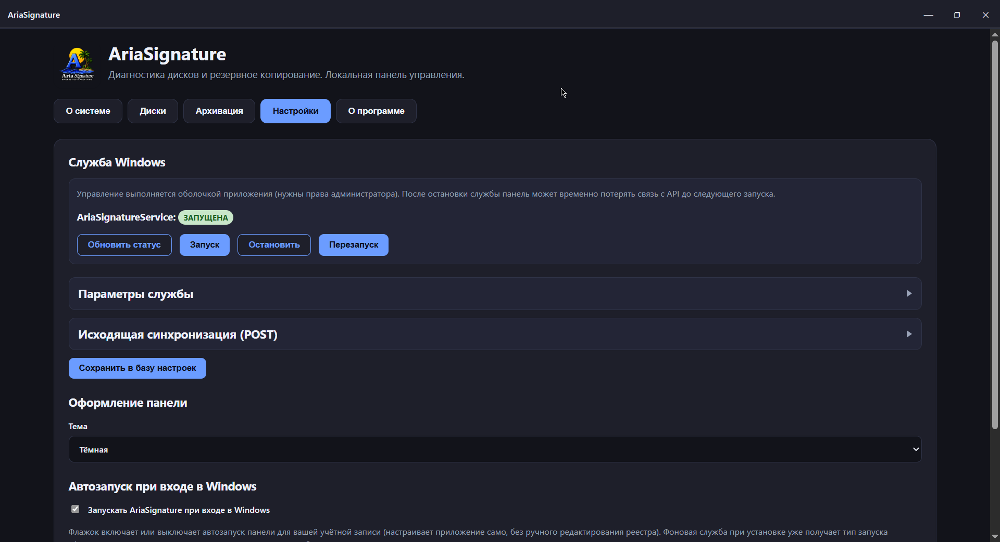
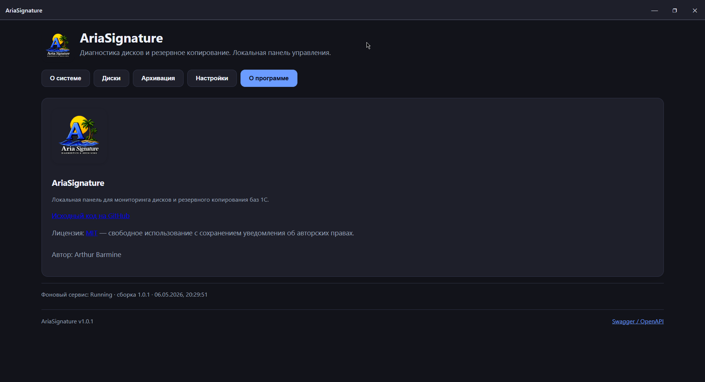

[](https://openyellow.org/grid?filter=top&repo=1225819392)

<div align="center">


</div>

# AriaSignature

Агент для **Windows**, рассчитанный на партнёров и франчайзи **1С** и на ИТ-службы с распределёнными клиентами. На каждой машине он собирает **диагностику дисков**, выполняет **резервное копирование** файловых баз (`.1CD`) и **Microsoft SQL Server**, и отдаёт всё это через **HTTP API** — чтобы вы могли **опрашивать парк машин с одной центральной точки** (VPN, закрытая сеть) **без постоянного удалённого рабочего стола** на каждый ПК.

Дополнительно, по желанию, агент может **периодически отправлять JSON на ваш сервер** (исходящий `POST` на коллектор) — это второй канал рядом с прямым `GET` по IP агента.

Проект распространяется под лицензией **MIT** — см. файл [`LICENSE`](LICENSE).

## Сообщество и репозиторий

- OpenYellow (каталог проекта): [openyellow.org/grid?filter=top&repo=1225819392](https://openyellow.org/grid?filter=top&repo=1225819392)
- Telegram-канал проекта: [t.me/ariasignature](https://t.me/ariasignature)

## Зачем это вам

- **Массовый мониторинг:** с вашей станции или скрипта: `http://<IP_клиента_в_VPN>:5160/api/v1/system`, `/disks`, `/backups`, `/backups/logs` — те же данные, что видит локальная панель (вкладка «О системе» соответствует `GET /system`).
- **Гибкая сеть:** Radmin VPN, корпоративная LAN или другой туннель; на агенте по умолчанию API слушает все интерфейсы, установщик добавляет правило брандмауэра для порта **5160**.
- **Опциональная защита:** общий токен в настройках — для запросов **не с localhost** требуется `Authorization: Bearer` или `X-Aria-Api-Key`; локальная панель на том же ПК заголовки не задаёт.

<p align="center">
  
</p>
<p align="center">
  
</p>

Подробный контракт и примеры запросов: [`docs/API.md`](docs/API.md).

## Для кого

- Франчайзи и интеграторы 1С: единый инструмент на рабочей станции клиента и единый способ снять состояние по API.
- Администраторы без привязки к 1С: контур «диагностика + архивация + HTTP API» без облачной привязки по умолчанию.

## Состав

| Компонент | Назначение |
|-----------|------------|
| `AriaSignature.Service` | Служба Windows: телеметрия, планировщик архивации, SQLite, хост API (в т.ч. доступ по LAN/VPN). |
| `AriaSignature.UI` | Панель управления (WPF + WebView2 + React). |
| `src/web` | Исходники SPA (Vite/React), собираются в `wwwroot` сервиса. |

Подробнее об архитектуре — [`docs/DEVELOPER_GUIDE.md`](docs/DEVELOPER_GUIDE.md).

## Документация

| Документ | Содержание |
|----------|------------|
| [`docs/USER_GUIDE.md`](docs/USER_GUIDE.md) | Руководство пользователя, сценарии UI. |
| [`docs/API.md`](docs/API.md) | Контракт REST API `/api/v1`, удалённый опрос, авторизация. |
| [`docs/DEVELOPER_GUIDE.md`](docs/DEVELOPER_GUIDE.md) | Модули, процессы разработки, версионирование. |
| [`docs/CHANGELOG.md`](docs/CHANGELOG.md) | История изменений. |
| [`docs/INSTALLER.md`](docs/INSTALLER.md), [`docs/RELEASE_GATE.md`](docs/RELEASE_GATE.md) | Сборка установщика и проверки. |
| [`docs/OPERATIONS_RUNBOOK.md`](docs/OPERATIONS_RUNBOOK.md) | Runbook эксплуатации, triage/recovery, SLO/SLI. |

В работающей установке доступен **Swagger**: `http://<хост>:<порт>/swagger`.

## Сборка из исходников

### Требования

- Windows 10/11 x64 (целевая платформа).
- [.NET 8 SDK](https://dotnet.microsoft.com/download/dotnet/8.0).
- [Node.js](https://nodejs.org/) **20+** (актуальный LTS подходит): сборка SPA генерирует `assets/branding/icon.ico` из **`assets/branding/logo.png`** (единый логотип для интерфейса, exe и установщика).
- На машине **клиента**, где выполняется архивация в RAR, нужен **WinRAR** с доступным `Rar.exe` (см. [`docs/USER_GUIDE.md`](docs/USER_GUIDE.md)); для разработки достаточно собрать решение без установки WinRAR на dev-ПК.

### Команды

Из корня репозитория:

```powershell
cd src/web
npm ci
npm run build
cd ..\..
dotnet build .\AriaSignature.slnx -c Release
dotnet test .\AriaSignature.slnx -c Release
```

SPA перед публикацией сервиса обязательно должна быть собрана: каталог `src/service/AriaSignature.Service/wwwroot/` генерируется скриптом сборки web и по умолчанию **не коммитится** (см. `.gitignore`).

Полный конвейер с инсталлятором (npm, тесты, publish UI/service, загрузка WebView2/smartctl при необходимости, Inno Setup):

```powershell
.\scripts\release-gate.ps1 -Configuration Release
```

Артефакт: `artifacts/installer/AriaSignature-Setup.exe`. Бинарники `installer/smartctl/` не входят в Git — их создаёт `release-gate` или их нужно положить вручную (см. [`installer/smartctl/README.md`](installer/smartctl/README.md)).

## Ветки и релизы

Функциональные изменения (например сетевой API) могут развиваться во **временных ветках** (например `test/remote-network-api`), затем по готовности сливаются в **основную тестовую** и **production** на [GitHub](https://github.com/erlkidd/ariasignature) и [GitFlic](https://gitflic.ru/project/erlkidd/ariasignature).

## FAQ — безопасность и эксплуатация

**Кто может дергать API?** Любой узел, который может установить TCP-сессию на порт агента. Ограничивайте доступ VPN/брандмауэром; при необходимости задайте общий токен в настройках службы. Не выставляйте порт в открытый интернет без обратного прокси и политики доступа.

**Что видит исходящая синхронизация (POST)?** По явному включению в настройках агент отправляет на указанный вами URL сводку о системе, дисках и архивации. Используйте **HTTPS** на коллекторе; ограничивайте доступ к endpoint на стороне сервера.

**Какие данные считать чувствительными?** Имена хостов, IP-адреса, модели дисков, пути архивов, журнал заданий — относитесь к экспорту как к персональным/коммерческим данным клиента согласно вашей политике.

**Права установки.** Инсталлятор и регистрация службы требуют прав администратора Windows.

<p align="center">
  
</p>

**Где хранится состояние?** Локальная база SQLite в профиле установки сервиса (см. документацию по эксплуатации).

## Участие в разработке

Изменения по контракту API и поведению сопровождайте обновлением `docs/API.md`, `docs/USER_GUIDE.md` и записью в `docs/CHANGELOG.md`. Список файлов для синхронизации версии продукта — в [`docs/DEVELOPER_GUIDE.md`](docs/DEVELOPER_GUIDE.md) (раздел «Версионирование»).

<p align="center">
  
</p>

## Лицензия

MIT © см. [`LICENSE`](LICENSE).
